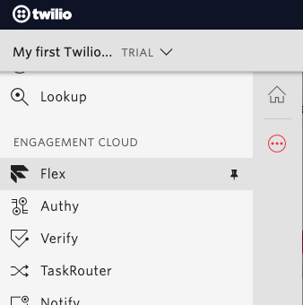
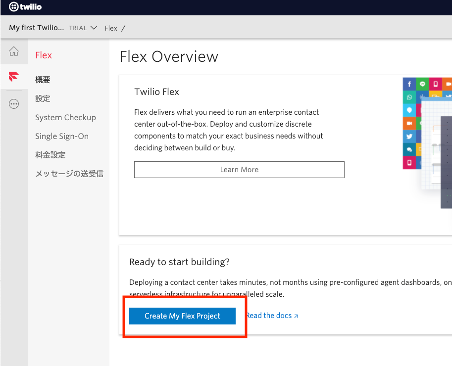
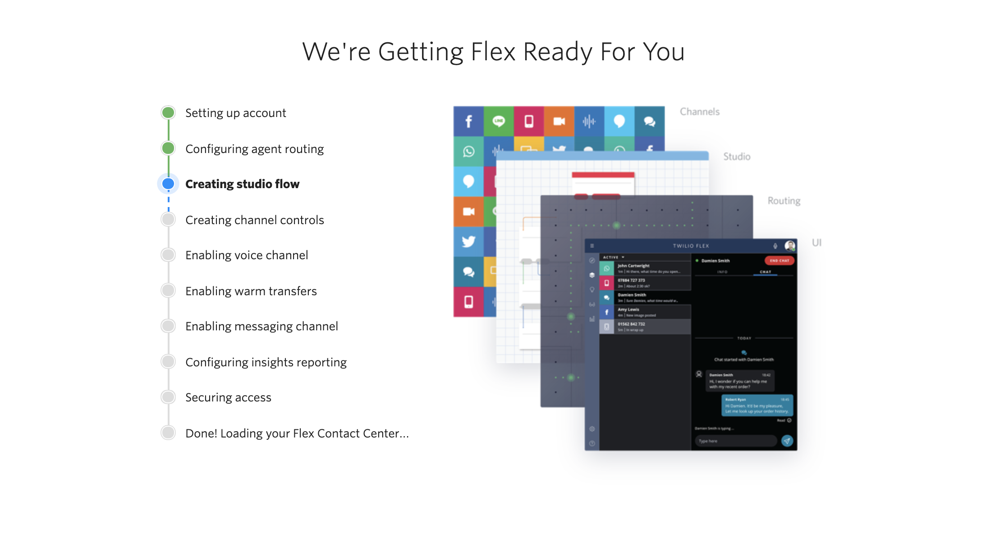

#  手順1: Flexプロジェクトの作成

すでにFlexプロジェクトを作成済みの場合は、[次の手順](02-Play-with-Flex.md)に進んでください。

アカウント作成時に`Flex`を選択していない場合は通常のTwilioプロジェクトが表示されます。その場合はこの後の手順に従ってください。作成は5分ほどで完了します。

> 短時間にTwilioプロジェクトを続けて作成した場合、不正利用だとみなされ、サスペンドされる可能性があります。特に同じ電話番号で連続認証した場合に発生しがちなためご注意ください。

## コンソールにアクセスし、Flexプロジェクトを作成
[Twilio コンソール](https://jp.twilio.com/console)を開きます。

コンソール左に表示されている[`...`]をクリックしサイドバーを表示させ、`Flex`をクリックするか、直接[Flex コンソール](https://jp.twilio.com/console/flex/overview)を開きます。

`概要`画面の`Create My Flex Project`ボタンをクリックし、プロジェクト作成を開始します。

Email、電話番号の検証を終えると、自動的にFlexインスタンスのセットアップとデプロイが開始されます。この処理は数分程度で完了します。

初期化が完了すると、__flex.twilio.com__ にリダイレクトされ、デプロイされた環境が表示されます。

## 次の手順

- [手順2: Flexの使用方法](02-Play-with-Flex.md)