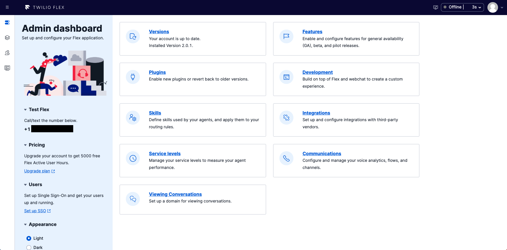

#  手順1: Twilioアカウントと、Flexプロジェクトを作成

すでにFlexプロジェクトを作成済みの場合は、[次の手順](02-Play-with-Flex.md)に進んでください。

## Twilioアカウントの作成

Twilioアカウントを保有していない場合は、下記のBlogに従い、アカウントを作成してください。また、作成中に使用用途を確認する質問が英語で表示されます。スクリーンショットを参考に`Flex`を選択してください。

[Blog - Twilioアカウントを作成する方法](https://www.twilio.com/blog/how-to-create-twilio-account-jp)

正しく選択できている場合は、Flexの初期化が実行され、その後、下記のような画面が表示されます。

ご自身の環境で上記の画面が表示されていることを確認し、[次の手順](02-Play-with-Flex.md)に進んでください。

アカウント作成時に`Flex`を選択していない場合は通常のTwilioプロジェクトが表示されます。

> 短時間に複数のTwilioプロジェクトを続けて作成した場合、不正利用だとみなされ、サスペンドされる可能性があります。特に同じ電話番号で連続認証した場合に発生しがちなためご注意ください。

## コンソールにアクセスし、Flexプロジェクトを作成
[Twilio コンソール](https://jp.twilio.com/console)を開きます。

コンソールに表示されている`Explore Products`をクリックし、製品一覧から`Flex`を選択するか直接[Flex コンソール](https://jp.twilio.com/console/flex/overview)を開きます。

ここで`Create my Flex account`ボタンをクリックするとアカウント名の選択指定、電話番号の確認、そして前のセクションと同様に利用用途の確認画面が表示されます。利用用途については`Flex`を選択してください。

初期化が完了すると、__flex.twilio.com__ にリダイレクトされ、Flexの初期画面が表示されます。

## 次の手順

- [手順2: Flexを試してみる](02-Play-with-Flex.md)