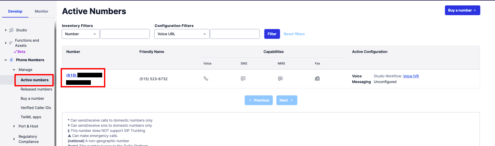

#  手順2: Flexを試してみる

この手順ではこれから設定するFlexの使用方法を学びます。

## ステータスをオンラインに変更

Flex画面の右上に表示されている自分自身のステータスを`Online`に変更します。

## 電話番号を確認

Flexを初期化した場合、米国番号が標準で割り当てられています。

番号は`Phone Numbers`コンソールで確認できます。[こちら](https://www.twilio.com/console/phone-numbers/incoming)のリンクを開き確認します。下記のスクリーンショットを確認してください。

この番号に電話をかけるとFlexの担当者に接続することができます。

トライアルアカウントを利用している場合は最初にトライアルである旨のメッセージが流れます。このメッセージはスキップできません。

> You have a trial account. You can remove this message at anytime by upgrading to full account. Press any to execute your code.

メッセージを最後まで聞いたあとに数字キーを押すと、`Agent Desktop`に着信番号を持つタスクが1つ増えます。

このタスクをクリックするとブラウザーと電話がつながります。

通話を終えたのち、`Complete`ボタンをクリックするとタスクが消えます。

Flexは標準で`音声`、`SMS`、`Webチャット`の3つに対応します。音声とSMSは携帯電話の通話料、メッセージ送信料金がかかります。

次のハンズオンでは音声問い合わせのフローをカスタマイズします。

## 次のハンズオン

- [ハンズオン: 問い合わせフローをカスタマイズ](../02-Customize-Flow/00-Overview.md)