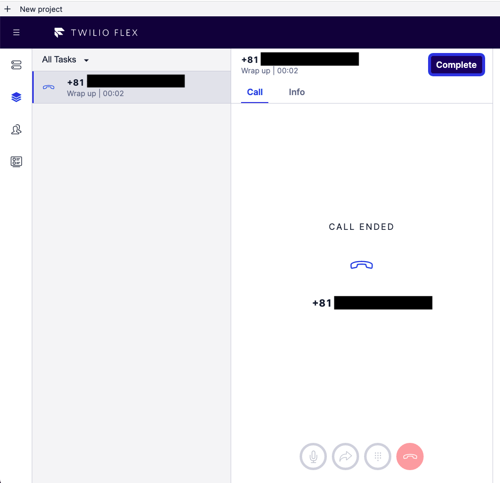

#  手順2: Flexプロジェクトの作成

この手順ではこれから設定するFlexの使用方法を学びます。

## タスクを表示

Flexの左サイドバーからタスク一覧画面を表示します。

この画面には管理者が最初にすべきもの、各担当者のタスク（問い合わせ）が表示されます。Flexを作成したユーザーは自動的に`管理者`として取り扱われます。

`1 - Try Flex`をクリックすると、自動的に取得した米国番号が表示されます。この番号が現在の問い合わせ番号です。

このハンズオンでは必須ではありませんが、ご自身の電話からこの番号にかけてみましょう。

トライアルアカウントを利用している場合は最初にトライアルである旨のメッセージが流れます。このメッセージはスキップできません。

> You have a trial account. You can remove this message at anytime by upgrading to full account. Press any to execute your code.

メッセージを最後まで聞いたあとに数字キーを押すと、着信番号を持つタスクが1つ増えます。

タスクが表示されない場合は右上のステータスが`Available`となっていることを確認します。

このタスクをクリックするとブラウザーと電話がつながります。

通話を終えたのち、`COMPLETE`ボタンをクリックするとタスクが消えます。

## Webチャットを表示

Flexは標準で`音声`、`SMS`、`Webチャット`の3つに対応します。音声とSMSは携帯電話の通話料、メッセージ送信料金がかかるため、このハンズオンではSMSを使用します。

`4 - Handle calls & messages`タスクを選択し、一番下までスクロールすると`LAUNCH WEBCHAT`ボタンを確認できます。

このボタンをクリックすると、スクリーン右側にテスト用のチャット領域が表示されます。

チャット画面にテキストを入力するとタスクが表示されることを確認します。

次のハンズオンから問い合わせフローをカスタマイズします。

## 次のハンズオン

- [ハンズオン: 問い合わせフローをカスタマイズ](../02-Customize-Chat-Flow/00-Overview.md)