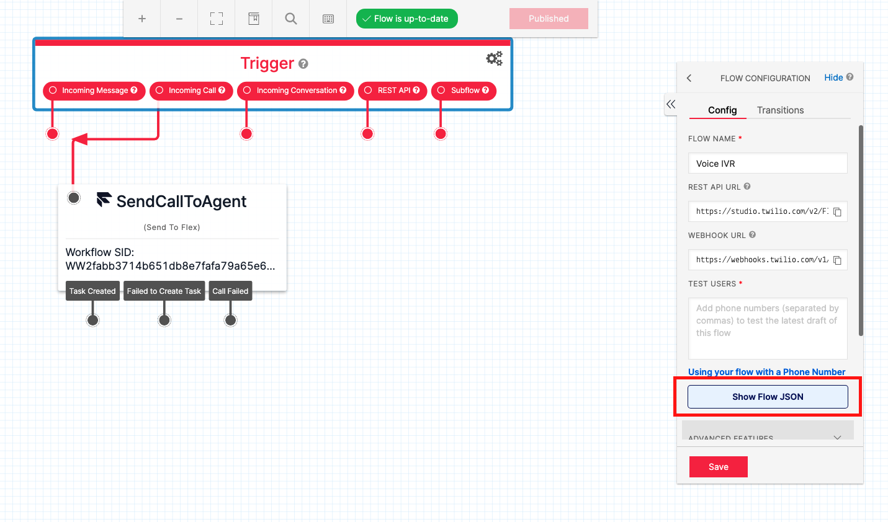
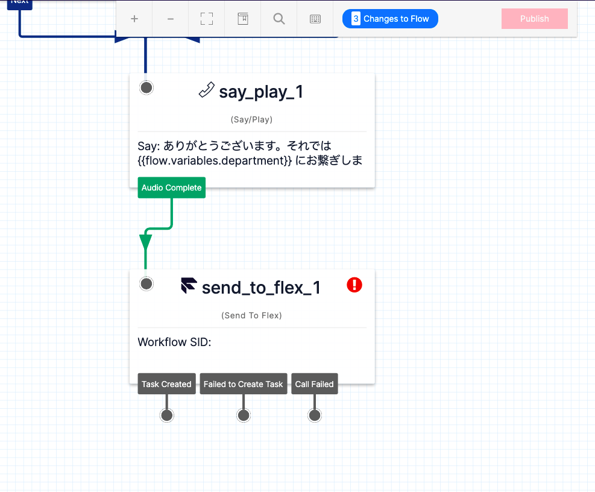
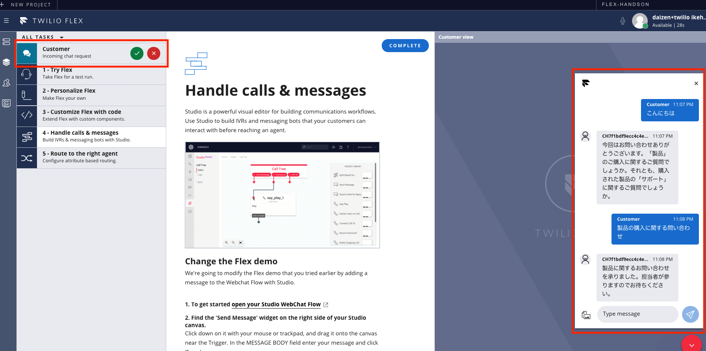

#  手順1: Webチャットの問い合わせフローをカスタマイズする

この手順ではWebチャットの問い合わせに使用されているフローをカスタマイズする方法を学習します。

## Webチャットの問い合わせフローを表示

`4 - Handle calls & messages`タスクを選択し`1. To get started open your Studio WebChat Flow `と書かれているリンクをクリックします。もし、このタスクを`COMPLETE`とし、削除してしまった場合は[こちら](https://jp.twilio.com/console/studio/dashboard)のリンクからStudioフローの一覧を表示し`Webchat Flow`をクリックします。

このリンクをクリックすると、WebChat問い合わせ時のフロー編集画面が表示されます。

デザイン画面に配置されている`Send To Flex`ウィジェットを選択し、右画面に表示される`ATTRIBUTES`の値を別の場所に控えておきます。

## フローの定義を更新

次に`Trigger`ウィジェットをクリックし、`Show Flow JSON`ボタンをクリックします。

表示されたダイアログに[こちら](../samples/webchatflow.json)のJSONをペーストし、`Save`ボタンをクリックします。このフローは問い合わせの際に製品の購入に関する問い合わせなのか、サポートに関する問い合わせなのかを質問します。

## Send To Flexウィジェットを追加

フローの最後は実装されていません。そこでTwilio Flexに問い合わせを送るため、`Send To Flex`ウィジェットを追加し、`send_message_1`ウィジェットの`Sent`と連結させます。

追加したウィジェットの設定を次のように変更します。

|設定項目|値|
|:----|:----|
|WORKFLOW| Assign to Anyone |
|CHANNEL| Programmable Chat|
|Attributes|先ほど控えた値|

下記のスクリーンショットも参考にしてください。

すべての設定を完了したのち、画面上部の`Publish`ボタンをクリックし、フローを公開します。

## チャットをテスト実行

Flexに戻り、再度Webチャットを起動してみましょう。質問に答えたのち、Flexにチャットタスクが追加されていれば設定が正しく行われています。

## 次のハンズオン

- [ハンズオン: スキルの作成と担当者への割り当て](../03-Create-and-Assign-Skills/00-Overview.md)