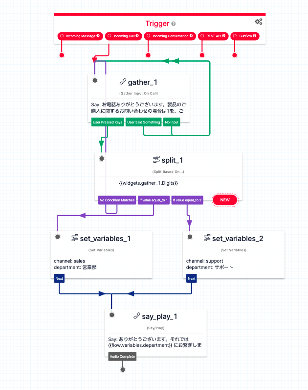

#  手順1: 問い合わせフローをカスタマイズする

この手順では問い合わせに使用されているフローをカスタマイズする方法を学習します。

## 問い合わせフローを表示

Flex Adminコンソールから`Communications`を選択します。


次の画面で`Flows`の`Edit`リンクをクリックします。


Flexにはそれぞれ、Webチャット用、SMSを含むメッセージ用、音声（電話）用の応答フローが用意されています。


`Voice IVR`のリンクをクリックすると、音声問い合わせ時のフロー編集画面が表示されます。


デザイン画面に配置されている`Send To Flex`ウィジェットを選択し、右画面に表示される`ATTRIBUTES`の値を別の場所に控えておきます。


```json
{ 
    "type": "inbound", 
    "name": "{{trigger.call.From}}" 
}
```

## フローの定義を更新

次に`Trigger`ウィジェットをクリックし、`Show Flow JSON`ボタンをクリックします。


表示されたダイアログには現在のフローの定義が表示されており、ビジュアルエディタを使用せず直接変更が可能です。


今回は[こちら](../samples/webchatflow.json)のJSONをペーストし、`Save`ボタンをクリックします。このフローは問い合わせの際に製品の購入に関する問い合わせなのか、サポートに関する問い合わせなのかを質問します。



うまくインポートされない場合は、画面の更新を行い、何度か繰り返してください。

## Send To Flexウィジェットを追加

フローの最後は実装されていません。そこでTwilio Flexに問い合わせを送るため、`Send To Flex`ウィジェットを追加し、`send_message_1`ウィジェットの`Sent`と連結させます。


追加したウィジェットの設定を次のように変更します。

|設定項目|値|
|:----|:----|
|WORKFLOW| Assign to Anyone |
|CHANNEL| Voice|
|Attributes|先ほど控えた値|


すべての設定を完了したのち、画面上部の`Publish`ボタンをクリックしてフローを公開します。

## 自動音声応答をテスト

Flexに戻り、再度電話をかけてみましょう。質問に答えたのち、Flexにタスクが追加されていれば設定が正しく反映されています。

## 次のハンズオン

- [ハンズオン: スキルの作成と担当者への割り当て](../03-Create-and-Assign-Skills/00-Overview.md)