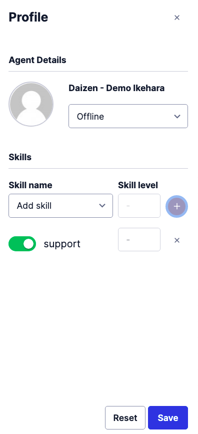

#  手順1: スキルの作成と担当者への設定

この手順ではFlex管理者コンソールでスキルを作成し、担当者にスキルを設定する方法を学習します。

## スキルを作成

Flex管理者コンソールを開き、`SKILLS`ボタンをクリックします。

`NAME OF SKILL`ボックスに`sales`と名前を入力し、`ADD NEW SKILL`ボタンをクリックします。

続けて同じように`support`スキルを作成します。2つのスキルが作成されていることを確認してください。

それぞれのスキルについて作成された`QUEUE EXPRESSIONS`と`WORKFLOW EXPRESSIONS`を控えておきます。

|LABEL|QUEUE EXPRESSIONS|WORKFLOW EXPRESSIONS|
|:----|:----|:-----|
|sales| routing.skills HAS "sales" | "sales" IN task.skillsNeeded |
|support| routing.skills HAS "support"| "support" IN task.skillsNeeded|

## スキルを担当者に設定

エージェント画面を表示し、フィルタリングを`All Agents`に設定します。

表示されたエージェントを選択し、`support`スキルを追加します。`Save`ボタンを忘れないようにしましょう。スクリーンショットを参考にしてください。

これでサポートスキルが管理者エージェントに追加されました。

## 次のハンズオン

- [ハンズオン: タスクルーティング - 部門別問い合わせキューを作成](../04-Task-Routing-Queue/00-Overview.md)