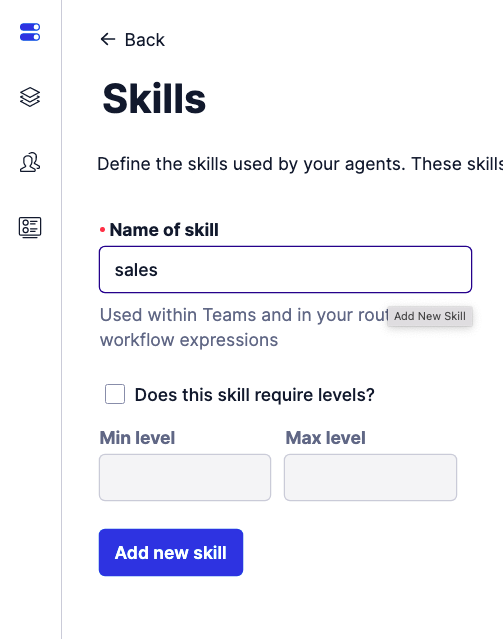

#  手順1: スキルの作成と担当者への設定

この手順ではFlex Admin画面でスキルを作成し、担当者にスキルを設定する方法を学習します。

## スキルを作成

Flex Admin画面を開き、`Skills`ボタンをクリックします。

`Name of skill`ボックスに`sales`と名前を入力し、`Add new skill`ボタンをクリックします。

続けて同じように`support`スキルを作成します。2つのスキルが作成されていることを確認してください。

それぞれのスキルについて作成された`QUEUE EXPRESSIONS`と`WORKFLOW EXPRESSIONS`を控えておきます。

|LABEL|QUEUE EXPRESSIONS|WORKFLOW EXPRESSIONS|
|:----|:----|:-----|
|sales| routing.skills HAS \"sales\" | \"sales\" IN task.skillsNeeded |
|support| routing.skills HAS \"support\"| \"support\" IN task.skillsNeeded|

## スキルを担当者に設定

エージェント画面を表示します。表示されたエージェントを選択し、`support`スキルを追加します。`Save`ボタンを忘れないようにしましょう。スクリーンショットを参考にしてください。

スキルが表示されない場合は、一旦タブをクローズし、[Flex](https://flex.twilio.com/)を再度開いてください。

これでサポートスキルが管理者エージェントに追加されました。

## 次のハンズオン

- [ハンズオン: タスクルーティング - 部門別問い合わせキューを作成](../04-Task-Routing-Queue/00-Overview.md)