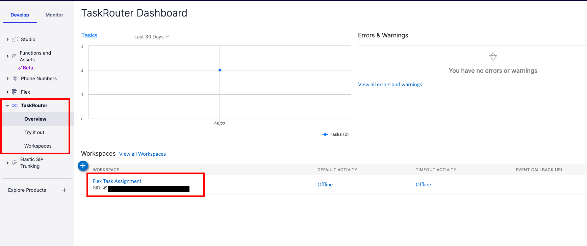

#  手順1: キューを作成する

この手順ではTwilioコンソールに用意されているTaskRouter画面に遷移し、Flex用にセールス、サポートそれぞれのキューを作成します。

## TaskRouterを表示

[TaskRouter](https://www.twilio.com/console/taskrouter)コンソールを開くと、`Flex Task Assignment`ワークスペースが定義されていることを確認できます。このワークスペースをクリックします。

キューの一覧が表示されます。標準ではすべての担当者が属する`Everyone`が表示されています。

`View all Task Queues`リンクをクリックします。

遷移先の画面で`+`ボタンをクリックしサポートキューを作成します。
下記のテーブルの設定値を参考にしてください。

|設定値|値|
|:----|:----|
|TASKQUEUE NAME| support |
|QUEUE EXPRESSION| routing.skills HAS \"support\"|

`QUEUE EXPRESSION`が正しく設定されていれば、`Matching Workers`に管理者エージェントが表示されます。

`Save`ボタンをクリックし保存します。

同じように `sales`キューを作成します。

|設定値|値|
|:----|:----|
|TASKQUEUE NAME| sales |
|QUEUE EXPRESSION| routing.skills HAS "sales"|

これでサポート、営業向けキューが追加されました。

## 次のハンズオン

- [ハンズオン: タスクルーティング - タスクフローを設定](../05-Task-Routing-Workflow/00-Overview.md)
