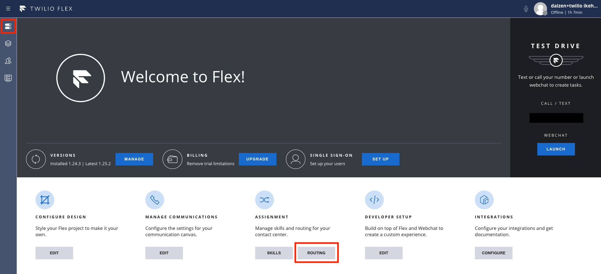
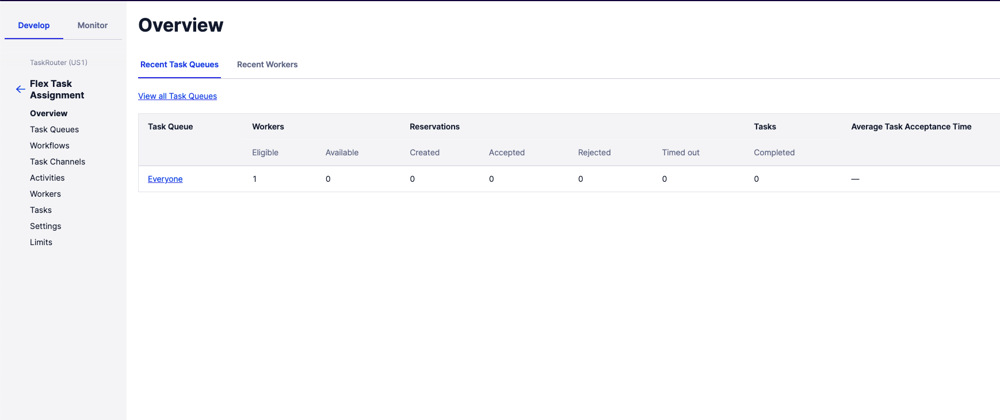

#  手順1: キューを作成する

この手順ではFlex管理者コンソールからTaskRouter画面に遷移し、セールス、サポートそれぞれのキューを作成します。

## TaskRouterを表示

Flex管理者コンソールを開き、`ROUTING`ボタンをクリックします。

TaskRouter画面が表示されます。`Flex Task Assignment`と名前のついた`Workspace`をクリックします。

サイドナビゲーションから`Task Queues`を選択しキューの一覧を表示します。

`+`ボタンをクリックしサポートキューを作成します。
下記のテーブルの設定値を参考にしてください。

|設定値|値|
|:----|:----|
|TASKQUEUE NAME| support |
|QUEUE EXPRESSION| routing.skills HAS \"support\"|

`QUEUE EXPRESSION`が正しく設定されていれば、`Matching Workers`に管理者エージェントが表示されます。

`Save`ボタンをクリックし保存します。

同じように `sales`キューを作成します。

|設定値|値|
|:----|:----|
|TASKQUEUE NAME| support |
|QUEUE EXPRESSION| routing.skills HAS "support"|

これでサポートスキルが管理者エージェントに追加されました。

## 次のハンズオン

- [ハンズオン: タスクルーティング - タスクフローを設定](../05-Task-Routing-Workflow/00-Overview.md)