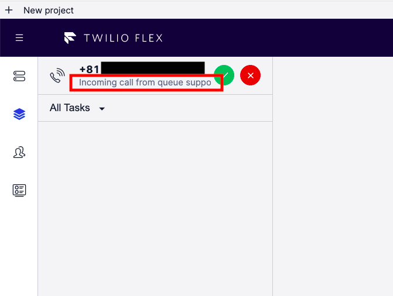
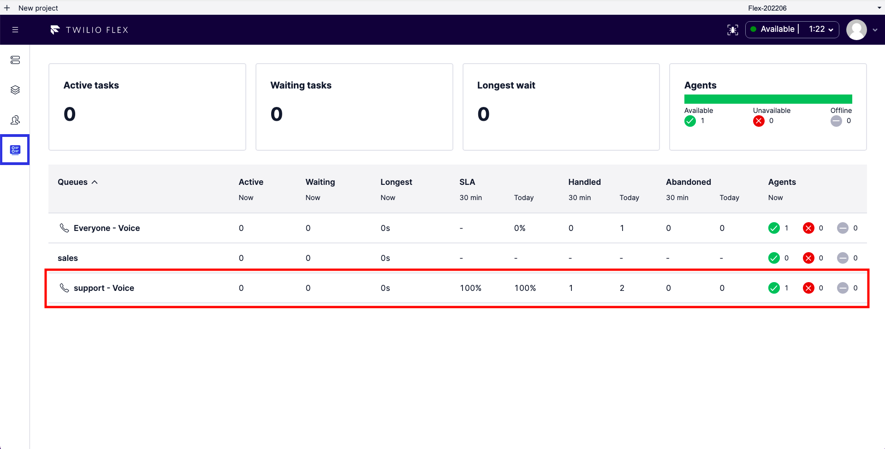

#  手順1: Workflowを設定する

さきほどのハンズオンから続けて`Workflow`を設定します。

## Workflowを表示

サイドナビゲーションから`Workflows`リンクをクリックし、`Assign to Anyone`フローをクリックします。

ワークフローを設定する方法はいくつかありますが、今回はこのフローにフィルタを設定してみましょう。

## フィルタを追加

`Add a Filter`ボタンをクリックし、フィルタ名を`support filter`、MATCHING TASKSを`"support" IN task.skillsNeeded`と設定します。その後、MATCHING WORKERSの`QUEUE`を`support`と指定します。下記のスクリーンショットを参考にしてください。

`Save`ボタンをクリックし変更を保存します。

## Studioフローを更新

[Twilio Studioコンソール](https://www.twilio.com/console/studio/dashboard)を開き、`Voice IVR`をクリックします。

`send_to_flex_1`ウィジェットをクリックし、`ATTRIBUTES`を[こちら](../samples/studio-attributes.json)に変更します。

この`JSON`では最後にユーザーの選択をFlexにデータとして渡しています。`Publish`ボタンをクリックし、フローを公開します。

## テスト実行

再度電話をかけ、サポートに問い合わせます。着信画面に表示されている`Queue`が`support`と表示されていれば成功です。

また、問い合わせ一覧画面においても`support - Voice`と表示されていることを確認します。

続いて営業部門に問い合わせた際にはフィルタ条件に合致していないので、初期の`Everyone`キューに通話がルーティングされていることを確認してください。

## まとめ

これでハンズオンは終了です。今回学習した項目は下記の通りです。

- `Twilio Flex`の立ち上げ
- `Studio`を使った問い合わせフローのカスタマイズ
- スキルの作成と割り当て
- `TaskRouter` - `TaskQueue`を使ったキューの作成
- `TaskRouter` - `Workflow`を使ったタスクフローのカスタマイズ

今回はフィルタ機能を使ってルーティングを行いましたが、別の方法も利用できます。詳細については次のチュートリアルをご覧ください。

[Twilio Flex Quickstart (Advanced): Multiple Users and Skills-based Routing](https://www.twilio.com/docs/flex/quickstart/flex-routing-skills)
