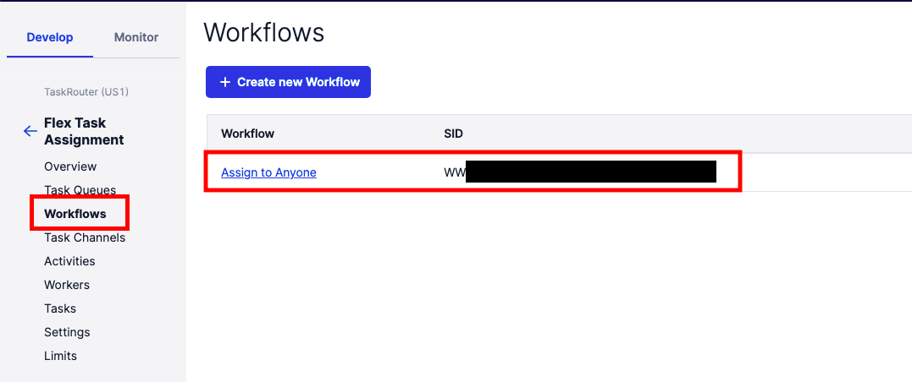
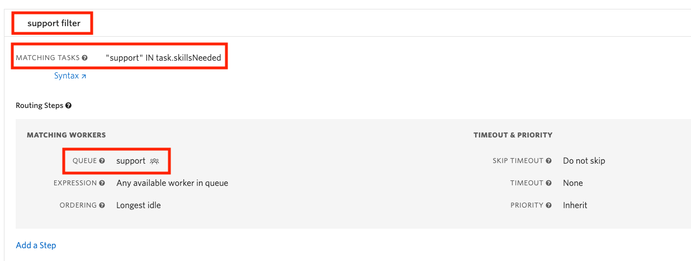
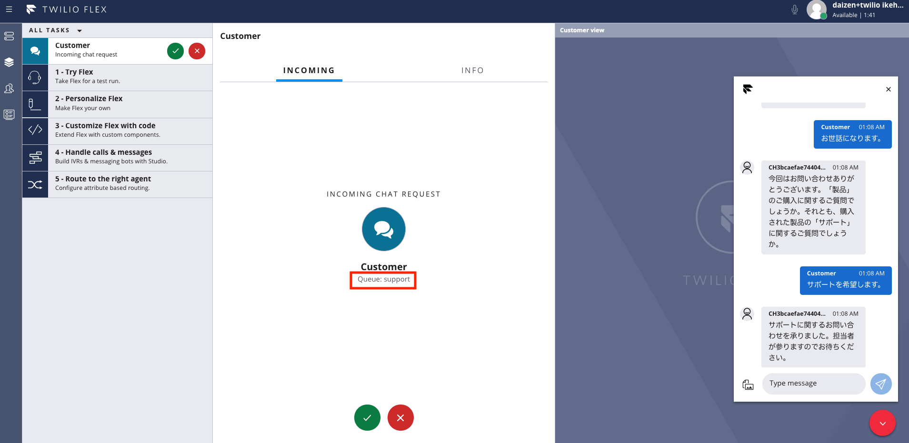

#  手順1: Workflowの設定を設定する

さきほどのハンズオンから続けて`Workflow`を設定します。

## Workflowを表示

サイドナビゲーションから`Workflows`リンクをクリックし、`Assign to Anyone`フローをクリックします。



ワークフローを設定する方法はいくつかありますが、今回はこのフローにフィルタを設定してみましょう。

## フィルタを追加

`Add a Filter`ボタンをクリックし、フィルタ名を`support filter`、MATCHING TASKSを`"sales" IN task.skillsNeeded`と設定します。その後、MATCHING WORKERSの`QUEUE`を`support`と指定します。下記のスクリーンショットを参考にしてください。



`Save`ボタンをクリックし変更を保存します。

## Studioフローを更新

[Twilio Studioコンソール](https://www.twilio.com/console/studio/dashboard)を開き、`Webchat Flow`をクリックします。

`send_to_flex_1`ウィジェットをクリックし、`ATTRIBUTES`を下記のものに変更します。

```json
{"name": "{{trigger.message.ChannelAttributes.from}}", "channelType": "{{trigger.message.ChannelAttributes.channel_type}}", "channelSid": "{{trigger.message.ChannelSid}}" , 
"task" : {"skillsNeeded" : ["{{flow.variables.channel}}"]}}
```

この`JSON`では最後にユーザーの選択をFlexにデータとして渡しています。`Publish`ボタンをクリックし、フローを公開します。

## テスト実行

Flex画面に戻り、Webチャットを再度立ち上げサポートに問い合わせます。チャット画面に表示されている`Queue`が`support`と表示されていれば成功です。



## まとめ

これでハンズオンは終了です。今回学習した項目は下記の通りです。

- Studioを使った問い合わせフローのカスタマイズ
- スキルの作成と割り当て
- TaskRouter - TaskQueueを使ったキューの作成
- TaskRouter - Workflowを使ったタスクフローのカスタマイズ

今回はフィルタ機能を使ってキューをわりふりましたが、別の方法も利用できます。詳細については次のチュートリアルをご覧ください。

[Twilio Flex Quickstart (Advanced): Multiple Users and Skills-based Routing](https://www.twilio.com/docs/flex/quickstart/flex-routing-skills)